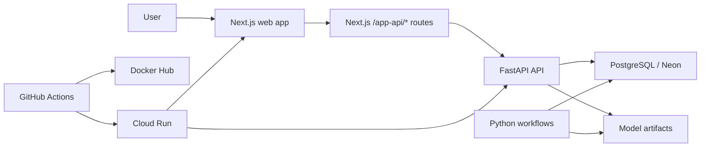

# Nova Assurances - Insurance Pricing Platform

Complete auto insurance pricing project covering:

1. a Python data science package for training, evaluation, and inference
2. a FastAPI API for prediction and quote management
3. a product-oriented Next.js frontend for clients and administrators
4. a PostgreSQL persistence layer with Alembic migrations
5. a GitHub Actions CI, Docker images, and Cloud Run deployment

The project has evolved from a model/benchmark foundation to a complete web application named `Nova Assurances`, featuring authentication, quote history, PDF generation, automatic quote recap emails, an admin area, and cloud deployment.

## Overview

### What the project does

The pricing engine calculates an auto premium from raw business data. It exposes:

1. Python workflows to train and compare models
2. HTTP endpoints to score a record for frequency, severity, or final premium
3. a client website to create a quote, view its history, and download a PDF
4. admin features to monitor accounts and moderate quotes
5. automatic quote recap emails with the PDF attached

### Main features

#### Data science

1. loading and preparation of training and test datasets
2. feature engineering and column schemas
3. multi-split benchmark and best run selection
4. persistence of model bundles in `artifacts/`
5. offline prediction and submission generation

#### Backend API

1. unitary and batch prediction endpoints
2. persistent quote endpoints
3. email + password authentication
4. PDF generation for each quote
5. admin endpoints for account and quote management
6. automatic Resend email delivery after quote creation
7. structured logs, readiness checks, and PostgreSQL persistence

#### Product frontend

1. "Nova Assurances" client landing page
2. guided quote flow
3. mandatory login before creating or viewing a quote
4. client area and quote history
5. admin console reserved for admin accounts
6. email delivery feedback in the quoting flow

#### DevOps

1. Python + frontend CI in GitHub Actions
2. Docker Hub build and publish
3. Cloud Run deployment
4. post-deployment web flow smoke test

## Architecture



## Repository structure

| Path | Role |
| --- | --- |
| `src/insurance_pricing/` | Main Python package |
| `src/insurance_pricing/api/` | FastAPI API, auth, quotes, admin, persistence |
| `src/insurance_pricing/training/` | Training configs and orchestration |
| `src/insurance_pricing/models/` | Frequency, severity, premium, and calibration models |
| `src/insurance_pricing/evaluation/` | Metrics and diagnostics |
| `src/insurance_pricing/inference/` | Offline prediction and submission |
| `src/insurance_pricing/runtime/` | Bundle persistence and DS exports |
| `src/insurance_pricing/workflows.py` | Stable Python facade |
| `web/` | Product Next.js frontend |
| `scripts/` | Utility tools, OpenAPI exports, smoke test |
| `tests/` | Unit and integration tests |
| `alembic/` | PostgreSQL migrations |
| `.github/workflows/` | CI, Docker publishing, Cloud Run deployment |
| `docs/` | GitHub / Cloud Run deployment documentation |

## Tech stack

### Backend and data science

1. Python 3.13
2. `uv` for dependency management
3. Pandas, NumPy, scikit-learn, CatBoost
4. FastAPI + Uvicorn
5. SQLAlchemy + Psycopg + Alembic
6. Argon2 for password hashing
7. ReportLab for PDF generation
8. Resend for transactional emails

### Frontend

1. Next.js 16
2. React 19
3. TypeScript
4. React Hook Form + Zod
5. TanStack Query
6. Tailwind CSS
7. OpenAPI client generated with `@hey-api/openapi-ts`

### Ops

1. Docker / Docker Compose
2. GitHub Actions
3. Docker Hub
4. Google Cloud Run
5. Neon PostgreSQL

## Business workflows

### 1. Training

The Python package allows training a pricing run from a JSON configuration file.

Typical workflow:

1. load datasets
2. build splits and verify their integrity
3. benchmark multiple models / settings
4. select the best run
5. train the final models
6. save the bundle in `artifacts/models/`

Command:

```bash
uv run insurance-pricing-train --config configs/<my-run>.json
```

### 2. Evaluation

Allows evaluating a saved run on the training / test sets.

```bash
uv run insurance-pricing-evaluate --run-id <run-id>
```

### 3. Offline prediction

Allows scoring a CSV with a given run.

```bash
uv run insurance-pricing-predict --run-id <run-id> --input data/test.csv --output outputs/predictions.csv
```

### 4. Submission

Allows building a submission from a run.

```bash
uv run insurance-pricing-make-submission --run-id <run-id> --output outputs/submission.csv
```

## FastAPI API

### Documentation

When the API is running:

1. Swagger UI: `/docs`
2. ReDoc: `/redoc`
3. OpenAPI JSON: `/openapi.json`

### Main endpoints

#### Metadata and health

1. `GET /`
2. `GET /version`
3. `GET /models/current`
4. `GET /health`
5. `GET /ready`

#### Prediction

1. `GET /predict/schema`
2. `POST /predict/frequency`
3. `POST /predict/frequency/batch`
4. `POST /predict/severity`
5. `POST /predict/severity/batch`
6. `POST /predict/prime`
7. `POST /predict/prime/batch`

#### Authentication

1. `POST /auth/register`
2. `POST /auth/login`
3. `GET /auth/session`
4. `POST /auth/logout`

#### Quotes

1. `POST /quotes`
2. `GET /quotes`
3. `GET /quotes/{quote_id}`
4. `GET /quotes/{quote_id}/report.pdf`

#### Administration

1. `GET /admin/users`
2. `DELETE /admin/users/{user_id}`
3. `GET /admin/quotes`
4. `DELETE /admin/quotes/{quote_id}`

### API notes

1. the API persists errors, sessions, and quotes in PostgreSQL
2. `GET /ready` verifies model loading and database connectivity
3. the quote endpoints are used by the Next.js frontend via its `/app-api/*` routes
4. in the current state of the project, the Cloud Run API is configured as public

## Next.js Frontend

The `web/` frontend is the "Nova Assurances" product layer.

### Client flow

1. public landing page
2. registration / login
3. protected access to quoting
4. quote creation
5. history consultation
6. PDF report download
7. automatic recap email with the quote PDF

### Admin flow

1. login with an account whose email is listed in `INSURANCE_PRICING_ADMIN_EMAILS`
2. access to `/admin`
3. account consultation
4. soft deletion of users and quotes

### Frontend specifics

1. quotes are blocked as long as no session is open
2. the browser only calls the frontend's same-origin `/app-api/*` routes
3. session cookies are managed server-side
4. the OpenAPI client is regenerated from `web/openapi.json`

See also: [web/README.md](web/README.md)

## Local installation

### Prerequisites

1. Python 3.13
2. Node.js 22
3. Docker Desktop
4. `uv`

### Dependency installation

```bash
uv sync --all-groups --frozen
```

For the frontend:

```bash
cd web
npm install
npm run codegen
npm run catalog:vehicles
```

## Local startup

### Option 1 - classic development mode

#### 1. Start PostgreSQL

```bash
docker compose up -d postgres
```

#### 2. Apply migrations

```bash
docker compose run --rm migrate
```

#### 3. Start the API

```bash
uv run insurance-pricing-api --host 127.0.0.1 --port 8000
```

#### 4. Start the frontend

```bash
cd web
npm run dev
```

### Option 2 - full stack preview with Docker Compose

```bash
docker compose --profile ops up --build postgres migrate api web
```

### Useful local URLs

1. frontend: `http://127.0.0.1:3000`
2. API: `http://127.0.0.1:8000`
3. Swagger: `http://127.0.0.1:8000/docs`
4. ReDoc: `http://127.0.0.1:8000/redoc`

## Important environment variables

### Backend

| Variable | Role |
| --- | --- |
| `INSURANCE_PRICING_RUN_ID` | model bundle to load |
| `INSURANCE_PRICING_DATABASE_URL` | PostgreSQL URL |
| `INSURANCE_PRICING_LOG_LEVEL` | log level |
| `INSURANCE_PRICING_LOG_JSON` | JSON logs |
| `INSURANCE_PRICING_CORS_ALLOWED_ORIGINS` | allowed origins |
| `INSURANCE_PRICING_ADMIN_EMAILS` | authorized admin emails |
| `INSURANCE_PRICING_SESSION_TTL_HOURS` | session duration |
| `INSURANCE_PRICING_ROOT_PATH` | public API prefix used behind a load balancer |
| `INSURANCE_PRICING_PUBLIC_WEB_URL` | public web URL inserted in recap emails |
| `INSURANCE_PRICING_RESEND_API_KEY` | Resend API key |
| `INSURANCE_PRICING_RESEND_SENDER_EMAIL` | verified sender email for recap emails |
| `INSURANCE_PRICING_RESEND_SENDER_NAME` | sender display name |

### Frontend

| Variable | Role |
| --- | --- |
| `API_BASE_URL` | upstream API URL |
| `API_AUDIENCE` | optional Cloud Run audience |
| `COOKIE_SECURE` | `false` in local HTTP, `true` in HTTPS |
| `NEXT_PUBLIC_BASE_PATH` | deploy-time path prefix, for example `/nova-assurance` |

Example variables are provided in:

1. [.env.example](.env.example)
2. [web/.env.example](web/.env.example)

## Tests and quality

### Main checks

```bash
uv run ruff check src tests scripts
uv run mypy
uv run pytest -m "not integration"
uv run pytest -m integration
```

### Frontend checks

```bash
cd web
npm run codegen
npm run lint
npm run typecheck
npm run build
```

## Docker

### Backend image

The root `Dockerfile` builds the API / Python runtime image.

### Frontend image

`web/Dockerfile` builds the production Next.js image.

### Compose

`docker-compose.yml` orchestrates:

1. `postgres`
2. `migrate`
3. `api`
4. `web`

## CI / CD

### CI

The [ci.yml](.github/workflows/ci.yml) workflow executes:

1. Python and Node installation
2. frontend OpenAPI client generation
3. frontend lint
4. frontend typecheck
5. frontend build
6. Ruff
7. MyPy
8. Alembic migrations
9. unit tests
10. integration tests
11. Docker smoke test
12. Docker Hub image publishing

### Docker Hub publishing

Two images are published:

1. API: `<dockerhub-user>/calcul-prime-assurance`
2. Web: `<dockerhub-user>/nova-assurances-web`

### Cloud Run Deployment

The [deploy-cloud-run.yml](.github/workflows/deploy-cloud-run.yml) workflow manages:

1. GCP authentication via Workload Identity Federation
2. Artifact Registry bootstrap if necessary
3. image build and push
4. migration job deployment
5. API deployment
6. web deployment
7. Resend email configuration through GitHub secrets / variables
8. post-deployment smoke test

In the current state:

1. `nova-web` is public
2. `nova-api` is public
3. the site can be built under a path prefix such as `/nova-assurance`
4. the smoke test validates the web flow and authentication

Related documentation:

1. [docs/deploy_cloud_run.md](docs/deploy_cloud_run.md)
2. [docs/github_only_deploy.md](docs/github_only_deploy.md)

## Web smoke test

The [smoke_web_app.py](scripts/smoke_web_app.py) script allows validating a web deployment.

Example:

```bash
uv run --group test python scripts/smoke_web_app.py --base-url "https://mohamed-khd.com/nova-assurance"
```

This test notably verifies:

1. landing page rendering
2. protection of `/devis` before login
3. registration
4. quote creation
5. history
6. PDF download
7. quote email delivery status is returned

## Additional documentation

1. [README_architecture.md](README_architecture.md): architecture / conventions overview
2. [docs/deploy_cloud_run.md](docs/deploy_cloud_run.md): GCP bootstrap and deployment
3. [docs/github_only_deploy.md](docs/github_only_deploy.md): GitHub-only configuration
4. [web/README.md](web/README.md): frontend details

## Project status

The project today covers an almost complete cycle:

1. experimentation and model selection
2. industrial HTTP exposure
3. client/admin web application
4. persistence, PDF, and recap email delivery
5. CI, Docker, Cloud Run, and custom-domain-ready path routing
