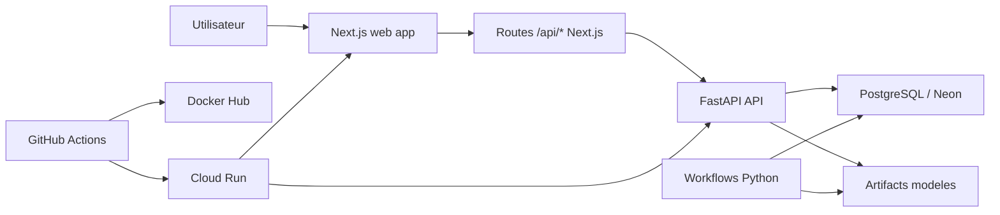

# Nova Assurances - Insurance Pricing Platform

Projet complet de tarification d'assurance auto couvrant :

1. un package Python de data science pour l'entrainement, l'evaluation et l'inference
2. une API FastAPI de prediction et de gestion des devis
3. un frontend Next.js oriente produit pour les clients et les administrateurs
4. une couche de persistance PostgreSQL avec migrations Alembic
5. une CI GitHub Actions, des images Docker, et un deploiement Cloud Run

Le projet a evolue d'un socle modele/benchmark vers une application web complete nommee
`Nova Assurances`, avec authentification, historique de devis, generation de PDF, espace admin et
deploiement cloud.

## Vue d'ensemble

### Ce que fait le projet

Le moteur de pricing calcule une prime auto a partir de donnees metier brutes. Il expose :

1. des workflows Python pour entrainer et comparer des modeles
2. des endpoints HTTP pour scorer un dossier en frequence, severite, ou prime finale
3. un site client pour creer un devis, consulter son historique et telecharger un PDF
4. des fonctionnalites admin pour superviser les comptes et moderer les devis

### Fonctionnalites principales

#### Data science

1. chargement et preparation des datasets d'apprentissage et de test
2. construction de features et schemas de colonnes
3. benchmark multi-splits et selection du meilleur run
4. persistance de bundles de modeles dans `artifacts/`
5. prediction offline et generation de soumissions

#### Backend API

1. endpoints de prediction unitaires et batch
2. endpoints de devis persistants
3. authentification par email + mot de passe
4. generation de PDF pour chaque devis
5. endpoints admin pour la gestion des comptes et devis
6. logs structures, readiness checks et persistance PostgreSQL

#### Frontend produit

1. landing page client "Nova Assurances"
2. parcours devis guide
3. connexion obligatoire avant creation ou consultation d'un devis
4. espace client et historique des devis
5. console admin reservee aux comptes admin

#### DevOps

1. CI Python + frontend dans GitHub Actions
2. build et publication Docker Hub
3. deploiement Cloud Run
4. smoke test post-deploiement du parcours web

## Architecture



## Structure du repository

| Chemin | Role |
| --- | --- |
| `src/insurance_pricing/` | Package Python principal |
| `src/insurance_pricing/api/` | API FastAPI, auth, devis, admin, persistance |
| `src/insurance_pricing/training/` | Configs et orchestration d'entrainement |
| `src/insurance_pricing/models/` | Modeles frequence, severite, prime, calibration |
| `src/insurance_pricing/evaluation/` | Metriques et diagnostics |
| `src/insurance_pricing/inference/` | Prediction offline et soumission |
| `src/insurance_pricing/runtime/` | Persistance des bundles et exports DS |
| `src/insurance_pricing/workflows.py` | Facade Python stable |
| `web/` | Frontend Next.js produit |
| `scripts/` | Outils utilitaires, exports OpenAPI, smoke test |
| `tests/` | Tests unitaires et integration |
| `alembic/` | Migrations PostgreSQL |
| `.github/workflows/` | CI, publication Docker, deploiement Cloud Run |
| `docs/` | Documentation de deploiement GitHub / Cloud Run |

## Stack technique

### Backend et data science

1. Python 3.13
2. `uv` pour la gestion des dependances
3. Pandas, NumPy, scikit-learn, CatBoost
4. FastAPI + Uvicorn
5. SQLAlchemy + Psycopg + Alembic
6. Argon2 pour le hash des mots de passe
7. ReportLab pour la generation PDF

### Frontend

1. Next.js 16
2. React 19
3. TypeScript
4. React Hook Form + Zod
5. TanStack Query
6. Tailwind CSS
7. client OpenAPI genere avec `@hey-api/openapi-ts`

### Ops

1. Docker / Docker Compose
2. GitHub Actions
3. Docker Hub
4. Google Cloud Run
5. Neon PostgreSQL

## Workflows metier

### 1. Entrainement

Le package Python permet d'entrainer un run de pricing a partir d'un fichier JSON de configuration.

Workflow type :

1. charger les jeux de donnees
2. construire les splits et verifier leur integrite
3. benchmarker plusieurs modeles / reglages
4. selectionner le meilleur run
5. entrainer les modeles finaux
6. sauver le bundle dans `artifacts/models/`

Commande :

```bash
uv run insurance-pricing-train --config configs/<mon-run>.json
```

### 2. Evaluation

Permet d'evaluer un run sauvegarde sur les jeux d'apprentissage / test.

```bash
uv run insurance-pricing-evaluate --run-id <run-id>
```

### 3. Prediction offline

Permet de scorer un CSV avec un run donne.

```bash
uv run insurance-pricing-predict --run-id <run-id> --input data/test.csv --output outputs/predictions.csv
```

### 4. Submission

Permet de construire une soumission a partir d'un run.

```bash
uv run insurance-pricing-make-submission --run-id <run-id> --output outputs/submission.csv
```

## API FastAPI

### Documentation

Quand l'API tourne :

1. Swagger UI : `/docs`
2. ReDoc : `/redoc`
3. OpenAPI JSON : `/openapi.json`

### Endpoints principaux

#### Metadata et health

1. `GET /`
2. `GET /version`
3. `GET /models/current`
4. `GET /health`
5. `GET /ready`

#### Prediction

1. `GET /predict/schema`
2. `POST /predict/frequency`
3. `POST /predict/frequency/batch`
4. `POST /predict/severity`
5. `POST /predict/severity/batch`
6. `POST /predict/prime`
7. `POST /predict/prime/batch`

#### Authentification

1. `POST /auth/register`
2. `POST /auth/login`
3. `GET /auth/session`
4. `POST /auth/logout`

#### Devis

1. `POST /quotes`
2. `GET /quotes`
3. `GET /quotes/{quote_id}`
4. `GET /quotes/{quote_id}/report.pdf`

#### Administration

1. `GET /admin/users`
2. `DELETE /admin/users/{user_id}`
3. `GET /admin/quotes`
4. `DELETE /admin/quotes/{quote_id}`

### Notes sur l'API

1. l'API persiste les erreurs, sessions et devis dans PostgreSQL
2. `GET /ready` verifie le chargement du modele et la connectivite base
3. les endpoints de devis sont utilises par le frontend Next.js via ses routes `/api/*`
4. en etat actuel du projet, l'API Cloud Run est configuree comme publique

## Frontend Next.js

Le frontend `web/` est la couche produit "Nova Assurances".

### Parcours client

1. accueil public
2. inscription / connexion
3. acces protege au devis
4. creation d'un devis
5. consultation de l'historique
6. telechargement du rapport PDF

### Parcours admin

1. connexion avec un compte dont l'email est liste dans `INSURANCE_PRICING_ADMIN_EMAILS`
2. acces a `/admin`
3. consultation des comptes
4. suppression logique d'utilisateurs et devis

### Particularites frontend

1. les devis sont bloques tant qu'aucune session n'est ouverte
2. le navigateur appelle uniquement les routes same-origin `/api/*` du frontend
3. les cookies de session sont geres cote serveur
4. le client OpenAPI est regenere depuis `web/openapi.json`

Voir aussi : [web/README.md](web/README.md)

## Installation locale

### Prerequis

1. Python 3.13
2. Node.js 22
3. Docker Desktop
4. `uv`

### Installation des dependances

```bash
uv sync --all-groups --frozen
```

Pour le frontend :

```bash
cd web
npm install
npm run codegen
npm run catalog:vehicles
```

## Demarrage local

### Option 1 - mode developpement classique

#### 1. Demarrer PostgreSQL

```bash
docker compose up -d postgres
```

#### 2. Appliquer les migrations

```bash
docker compose run --rm migrate
```

#### 3. Lancer l'API

```bash
uv run insurance-pricing-api --host 127.0.0.1 --port 8000
```

#### 4. Lancer le frontend

```bash
cd web
npm run dev
```

### Option 2 - preview full stack avec Docker Compose

```bash
docker compose --profile ops up --build postgres migrate api web
```

### URLs utiles en local

1. frontend : `http://127.0.0.1:3000`
2. API : `http://127.0.0.1:8000`
3. Swagger : `http://127.0.0.1:8000/docs`
4. ReDoc : `http://127.0.0.1:8000/redoc`

## Variables d'environnement importantes

### Backend

| Variable | Role |
| --- | --- |
| `INSURANCE_PRICING_RUN_ID` | bundle modele a charger |
| `INSURANCE_PRICING_DATABASE_URL` | URL PostgreSQL |
| `INSURANCE_PRICING_LOG_LEVEL` | niveau de log |
| `INSURANCE_PRICING_LOG_JSON` | logs JSON |
| `INSURANCE_PRICING_CORS_ALLOWED_ORIGINS` | origines autorisees |
| `INSURANCE_PRICING_ADMIN_EMAILS` | emails admin autorises |
| `INSURANCE_PRICING_SESSION_TTL_HOURS` | duree des sessions |

### Frontend

| Variable | Role |
| --- | --- |
| `API_BASE_URL` | URL de l'API amont |
| `API_AUDIENCE` | audience Cloud Run optionnelle |
| `COOKIE_SECURE` | `false` en local HTTP, `true` en HTTPS |

Les exemples de variables sont fournis dans :

1. [.env.example](.env.example)
2. [web/.env.example](web/.env.example)

## Tests et qualite

### Checks principaux

```bash
uv run ruff check src tests scripts
uv run mypy
uv run pytest -m "not integration"
uv run pytest -m integration
```

### Checks frontend

```bash
cd web
npm run codegen
npm run lint
npm run typecheck
npm run build
```

## Docker

### Image backend

Le `Dockerfile` racine construit l'image de l'API / runtime Python.

### Image frontend

`web/Dockerfile` construit l'image Next.js de production.

### Compose

`docker-compose.yml` orchestre :

1. `postgres`
2. `migrate`
3. `api`
4. `web`

## CI / CD

### CI

Le workflow [ci.yml](.github/workflows/ci.yml) execute :

1. installation Python et Node
2. generation du client OpenAPI frontend
3. lint frontend
4. typecheck frontend
5. build frontend
6. Ruff
7. MyPy
8. migrations Alembic
9. tests unitaires
10. tests d'integration
11. smoke Docker
12. publication des images Docker Hub

### Publication Docker Hub

Deux images sont publiees :

1. API : `<dockerhub-user>/calcul-prime-assurance`
2. Web : `<dockerhub-user>/nova-assurances-web`

### Deploiement Cloud Run

Le workflow [deploy-cloud-run.yml](.github/workflows/deploy-cloud-run.yml)
gere :

1. authentification GCP par Workload Identity Federation
2. bootstrap d'Artifact Registry si necessaire
3. build et push des images
4. deploiement du job de migration
5. deploiement de l'API
6. deploiement du web
7. smoke test post-deploiement

En l'etat actuel :

1. `nova-web` est public
2. `nova-api` est public
3. le smoke test valide le parcours web et l'authentification

Documentation associee :

1. [docs/deploy_cloud_run.md](docs/deploy_cloud_run.md)
2. [docs/github_only_deploy.md](docs/github_only_deploy.md)

## Smoke test web

Le script [smoke_web_app.py](scripts/smoke_web_app.py) permet de valider
un deploiement web.

Exemple :

```bash
uv run --group test python scripts/smoke_web_app.py --base-url https://nova-web-xxxxx.a.run.app
```

Ce test verifie notamment :

1. le rendu de la landing page
2. la protection de `/devis` avant connexion
3. l'inscription
4. la creation d'un devis
5. l'historique
6. le telechargement PDF

## Documentation complementaire

1. [README_architecture.md](README_architecture.md) : vue architecture / conventions
2. [docs/deploy_cloud_run.md](docs/deploy_cloud_run.md) : bootstrap et deploiement GCP
3. [docs/github_only_deploy.md](docs/github_only_deploy.md) : configuration GitHub-only
4. [web/README.md](web/README.md) : details frontend

## Etat du projet

Le projet couvre aujourd'hui un cycle quasi complet :

1. experimentation et selection de modeles
2. exposition HTTP industrielle
3. application web client/admin
4. persistance et PDF
5. CI, Docker, Cloud Run

Il est donc adapte a :

1. un projet de fin d'etudes
2. une demo portfolio full-stack / MLOps
3. une base technique pour aller vers un produit plus complet
